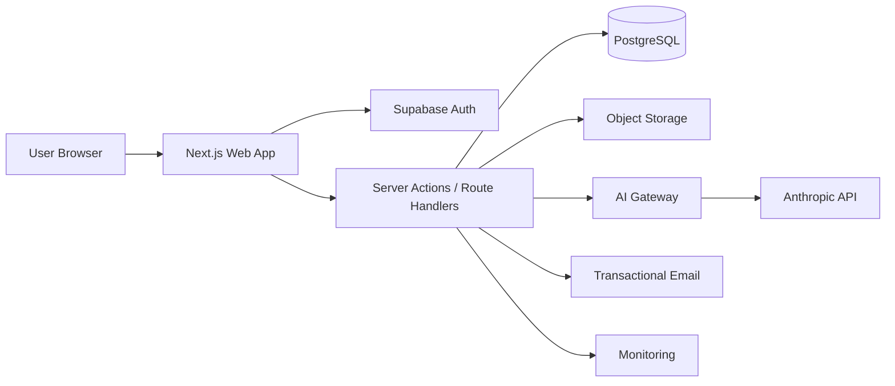
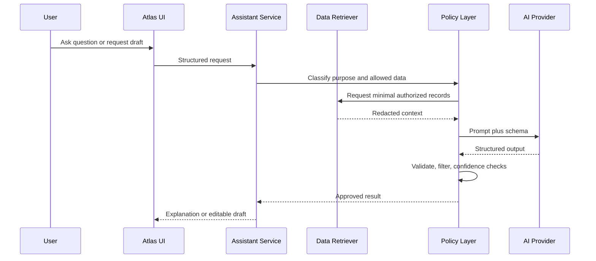

# Atlas Technical Architecture

## 1. Purpose

This document defines the MVP architecture for Atlas. The architecture prioritizes security, explainability, maintainability, and fast iteration by a small team using Claude Code.

## 2. Architectural principles

1. Server-side authorization for every protected operation.
2. Row-level security as defense in depth, not the only authorization layer.
3. Personal data is minimized, classified, and masked.
4. AI is an assistive subsystem, never the source of truth.
5. Business rules are deterministic where possible.
6. External effects require explicit user approval.
7. Every score change and request transition is auditable.
8. The product must function in a limited form when AI is unavailable.

## 3. Recommended stack

### Application

- Next.js with App Router
- TypeScript in strict mode
- React Server Components by default
- Tailwind CSS
- shadcn/ui primitives
- Radix UI behavior primitives
- Lucide icons
- Recharts for simple charts
- Zod for validation
- React Hook Form for complex forms

### Data and authentication

- Supabase Auth
- PostgreSQL
- Supabase Storage for user exports and approved attachments
- Row Level Security on all user-owned tables
- Supabase Edge Functions or server-side Next.js jobs for controlled background work

### AI

- Anthropic API through a server-only adapter
- Structured outputs validated with Zod
- Retrieval limited to user-authorized Atlas records and curated product guidance
- Provider abstraction to support future replacement

### Hosting and operations

- Vercel for the web application
- Supabase managed database and authentication
- GitHub repository and Actions
- Error monitoring and privacy-safe product analytics
- Transactional email provider for authentication and system notices
- Durable shared store for rate limiting (Vercel KV, Upstash Redis, or equivalent; provider selection is an open decision, but a shared durable counter store is required — serverless instances cannot rate-limit in memory)

Provider versions should be pinned at implementation time. Do not place version numbers in product requirements unless tested.

## 4. System context



## 5. Trust boundaries

- Browser is untrusted.
- Client state is not authorization evidence.
- Next.js server layer is trusted only after authentication and input validation.
- Database enforces RLS for user-owned records.
- AI provider is an external processor and receives the minimum necessary context.
- Analytics and monitoring must never receive raw personal-data fields.
- Email handoff is user-approved and must not be initiated from background automation in MVP.

## 6. Application architecture

### 6.1 Route groups

```text
app/
  (public)/
    page.tsx
    privacy/
    terms/
  (auth)/
    sign-in/
    verify/
  (product)/
    layout.tsx
    overview/
    assets/
    assets/[assetId]/
    insights/
    requests/
    requests/[requestId]/
    activity/
    archive/
    settings/
  api/
    ai/
    exports/
    webhooks/
```

### 6.2 Layering

```text
UI components
  ↓
Feature modules
  ↓
Application services
  ↓
Repositories / external adapters
  ↓
Database and external providers
```

UI code must not call the database or AI provider directly.

### 6.3 Suggested repository structure

```text
src/
  app/
  components/
    ui/
    layout/
  features/
    auth/
    onboarding/
    dashboard/
    assets/
    findings/
    requests/
    activity/
    assistant/
    settings/
  server/
    auth/
    services/
    repositories/
    ai/
    jobs/
    audit/
  lib/
    validation/
    formatting/
    permissions/
    telemetry/
  types/
  test/
supabase/
  migrations/
  seed.sql
  tests/
docs/
```

## 7. Data model

All identifiers use UUIDs. All tables include `created_at` and `updated_at` unless noted.

### 7.1 profiles

- `id`: UUID, references authenticated user (primary key doubles as owner column; RLS uses `auth.uid() = id` — this is the one permitted exception to the `user_id` rule in §8)
- `display_name`
- `timezone`
- `locale`
- `onboarding_completed_at`
- `onboarding_state_json`: saved step progress for resumable onboarding (step, choices; no sensitive values). ATL-017 defines the shape in `src/lib/onboarding/onboarding-state.ts` — exactly `step`, `privacyGoal`, `categories`, `startingPoint`, every one an id from a closed vocabulary. Read through `parseOnboardingState`, never raw: the column's only database constraint is `jsonb_typeof(...) = 'object'`, so a malformed or tampered value must degrade to a usable flow rather than break it. Recovery is field-by-field, and an unreadable step falls back to the first one. AI-processing consent is deliberately **not** stored here — restoring a ticked box would produce agreement the user never gave on that visit (ATL-016, ATL-078). Cleared when onboarding completes, since every answer is then held in its own column.
- `privacy_goal`
- `selected_categories`: asset categories chosen during onboarding
- `demo_data_enabled`

### 7.2 digital_assets

- `id`
- `user_id`
- `service_name`
- `service_domain`
- `category`: the **kind of service** — `social`, `shopping`, `finance`, `email`, `entertainment`, `health`, `work`, `travel`, `other`. Defined in `src/lib/assets/categories.ts` (ATL-016, which needed it first for onboarding step 3) and inherited by ATL-027. Distinct from §7.3's data categories: `social` is what a service **is**, `contact` is what it **stores**
- `account_identifier_encrypted`
- `status`: active, inactive, archived, removed
- `source_type`: manual, demo, connector, import
- `source_label`
- `confidence`
- `last_verified_at`
- `notes`
- `metadata_json`

ATL-027 implementation notes. `status`, `source_type`, and `confidence` are check-constrained in SQL **and** listed in `src/lib/assets/asset-fields.ts` — deliberate duplication, because §11's rules read these values and a drifted one would silently change what a rule means. `category` is constrained by shape only; its vocabulary stays in `src/lib/assets/categories.ts` so an append-only migration never has to race an application constant. `metadata_json` is allowlisted in `src/lib/assets/asset-metadata.ts`, built on the ATL-085 redaction utility rather than a parallel validator; the column is not in the §8 encrypted inventory, so anything restricted reaching it would be stored in plaintext. Clients get `select`, `insert`, and `update` scoped to `auth.uid() = user_id`, and no `delete`: removal is a status transition (ATL-036), and hard deletion is server-side only — demo removal (ATL-083) and the account cascade.

### 7.3 asset_data_categories

- `id`
- `user_id`
- `asset_id`
- `category`: identity, contact, location, financial, behavioral, biometric, content, device, professional, health, other
- `description`
- `sensitivity`
- `source`
- `confidence`

ATL-028 implementation notes. **Cross-user protection is structural**: the foreign key is composite — `(user_id, asset_id)` references `digital_assets (user_id, id)` — so a row claiming one owner while pointing at another's asset cannot exist, even for service-role writes that bypass RLS. A single-column reference would have satisfied referential integrity while leaving such a row invisible to both users and still countable by the rules engine. The composite target required adding `unique (user_id, id)` to `digital_assets`, done additively in ATL-028's own migration rather than by editing ATL-027's.

**`sensitivity` is a generated column, not a stored choice.** ADR-004 fixes the high-sensitivity set at financial, health, biometric, and location, and the score's data-sensitivity factor counts active-asset × high-sensitivity-category pairs from that list — so sensitivity is a property of the category, not of the row. Postgres generates it (`high` for the ADR-004 set, `standard` otherwise) and rejects any attempt to supply or update it. The same mapping is mirrored in `src/lib/assets/data-categories.ts` for the application, and the schema test asserts the two agree. A writable column would let a user downgrade a `financial` category to keep it out of their own score.

`unique (user_id, asset_id, category)` prevents one fact being recorded twice, which would deduct twice in ADR-004's factor and inflate R-008's count. Clients get `delete` here, unlike `digital_assets`: removing a category is ordinary editing (ATL-033), not the destruction of a record carrying its own history.

### 7.4 asset_permissions

- `id`
- `user_id`
- `asset_id`
- `permission_type`
- `scope`
- `status`
- `last_verified_at`

ATL-029 implementation notes. §7.4 enumerates none of these, and only two values appear anywhere in the documentation — `broad` (R-004, ADR-004) and `active` (R-004, R-005) — so each vocabulary below was settled as a product decision and sized to the smallest set its consumers need.

**`scope` is `broad | limited`** — a classification, not the raw grant. ADR-004's factor is `100 × (1 − broad-scope active ÷ total recorded)` and R-004 asks only "is this broad?", so both consumers read a binary. A richer scope list can be added later without changing what the score reads. **`status` is `active | revoked | unknown`**: only `active` raises R-004/R-005, but *every* status counts in ADR-004's "total recorded" denominator — that asymmetry is deliberate, so revoking a permission improves the factor rather than erasing the evidence it existed. `unknown` exists because the honesty rules do not permit forcing a user to assert a state they cannot verify. **`permission_type` is shape-constrained in SQL and vocabulary-constrained in the application** — the same split `digital_assets.category` uses. The list, settled as a product decision in ATL-033 because no document enumerated one, is `account_access | data_sharing | marketing | device_access | other`, grouped by what the permission lets a service do to the user rather than by any provider's naming. It lives in `src/lib/assets/permissions.ts`, is enforced by `AssetService.addPermission`, and is offered as a fixed choice in the UI: free text would let one grant be recorded under two names, and both would count in ADR-004's "total recorded" denominator. Widening the list later is additive and needs no migration, which is why it is not a SQL enum.

**There is no expiry column.** §7.4 lists none and no rule or factor reads one; R-005 measures staleness from `last_verified_at`, where null (never verified) is included in the stale population rather than skipped. Cross-user protection reuses ATL-028's composite foreign key against `digital_assets (user_id, id)`, so ATL-029 needed no additive constraint of its own. `unique (user_id, asset_id, permission_type)` keeps a duplicate from moving ADR-004's denominator.

### 7.5 privacy_findings

- `id`
- `user_id`
- `asset_id`, nullable
- `finding_type`
- `rule_id`: identifier of the generating rule (see §11), null for demo-seeded findings
- `rule_version`: rule catalog version at generation time
- `dedup_key`: deterministic hash of rule ID and entity scope; unique per user, prevents duplicate findings for the same condition
- `title`
- `description`
- `severity`: low, medium, high, critical
- `confidence`
- `source_type`
- `source_reference`
- `evidence_summary`: human-readable, contains no restricted values
- `evidence_refs_json`: IDs of the records the rule evaluated
- `recommended_action`
- `status`: open, in_progress, resolved, dismissed
- `resolved_by`: user, system (system when auto-resolved because the rule predicate no longer holds)
- `resolved_at`

### 7.6 privacy_score_snapshots

- `id`
- `user_id`
- `score`
- `score_version`: e.g. `score-v1`; snapshots are never recomputed under later versions
- `is_demo`: true when computed exclusively over demo records; demo snapshots are deleted with demo data
- `factor_breakdown_json`: factor scores, inputs, weights, and which factors were excluded for missing data
- `reason`
- `recorded_at`

### 7.7 data_requests

Named `data_requests` (not `deletion_requests`) because the MVP supports both deletion and correction requests (PRD FR-08, asset detail actions). Migrations are append-only after shared deployment, so the name must be right from the first migration.

- `id`
- `user_id`
- `asset_id`
- `request_type`: deletion, correction
- `status`
- `recipient_encrypted`: recipient addresses are Restricted data (email addresses) and are encrypted like the body; list views show the associated service name and a masked recipient
- `subject_encrypted`: subjects frequently contain personal identifiers and receive the same protection
- `body_encrypted`
- `included_fields_json`: approved personal-field keys only, never values
- `delivery_method`: copy, mailto, manual
- `sent_at`
- `follow_up_at`
- `completed_at`
- `external_reference`
- `last_status_note`

### 7.8 request_events

- `id`
- `user_id`
- `request_id`
- `event_type`
- `from_status`
- `to_status`
- `summary`
- `actor_type`: user, system
- `occurred_at`

### 7.9 activity_events

The user-facing product timeline (PRD FR-09, frontend §13). RLS enabled: the owner may SELECT their own rows. There is **no INSERT, UPDATE, or DELETE policy** — events are written by services through the shared emitter (ATL-069), and rows leave with the account cascade.

- `id`
- `user_id`
- `event_type`: shape-constrained here, enumerated and typed in the application (ATL-069)
- `entity_type`, `entity_id`: both or neither, enforced by a check constraint
- `summary`: the line the user reads. No restricted values — masked identifiers at most (ATL-069)
- `metadata_redacted_json`: allowlisted structured context, validated in the application by the ATL-085 redaction utility (`src/lib/activity/activity-metadata.ts`)
- `occurred_at`, `created_at`

**Client write access (ATL-068).** Undocumented before this ticket, so recorded here. A user cannot insert, edit, or delete individual events: a selectively-erasable timeline is a weaker record, including for the user who later wants to know when a change actually happened. ADR-006's "deleted with the account" is satisfied by the cascade. A future "clear history" action would be additive.

**Metadata allowlist scope.** Only non-identifying categories are permitted today — statuses and transitions, counts, scores, classification labels, versions, and the demo flag. No free text and no identifiers beyond the `entity_id` column the table already models. The list grows with each feature milestone that emits new events, exactly as the ADR-006 audit inventory does.

**Indexes.** `(user_id, occurred_at desc, id desc)` for the timeline, a partial index on `(user_id, entity_type, entity_id)` for entity links, and `(user_id, event_type, occurred_at desc)` for action filters. The `id` tiebreak is load-bearing: `occurred_at` is millisecond-resolution, so without it the sort is ambiguous and the cursor pagination ATL-070 requires can repeat or skip a row at a page boundary.

### 7.10 consents

Append-only consent history. RLS enabled: the owner may SELECT their own rows (Settings renders the history, ATL-076); there is **no client INSERT policy**, because recording consent must stamp the server's policy version and emit an audit event.

- `id`
- `user_id`
- `consent_type`: one of `ai_processing`, `personal_fields_storage`, `ai_conversation_history`, `product_updates`
- `policy_version`: the version in force when the decision was recorded. Never back-filled — consent is to the terms as they stood
- `granted`: true for a grant, false for a revocation. Both are rows
- `recorded_at`

**Schema change (ATL-078).** This section previously also listed `revoked_at`. That column and ATL-078's requirement that "grant/revoke writes an immutable consent row" cannot both hold: populating `revoked_at` means mutating a row that is meant to be evidence of what was agreed at a point in time. An append-only log also makes grant → revoke → re-grant reconstructible, which a single mutable row cannot represent at all. `revoked_at` is therefore dropped; current state is the newest row per `(user_id, consent_type)`.

**Immutability.** UPDATE is refused by trigger for every role including the owner. DELETE is *not* trigger-blocked, unlike `audit_events`: this table cascades from `auth.users`, and a raising BEFORE DELETE trigger would make account deletion impossible. DELETE is withheld by grant instead, which the cascade does not consult.

**Policy version source.** `CONSENT_POLICY_VERSION` in `src/config/app.ts` — a reviewed constant rather than an environment variable, so every change to the terms is a code change with an author, a date, and a diff. Bump it when the policy text changes in a way that requires re-consent; the consent gate denies a grant recorded against a superseded version.

### 7.11 ai_interactions

Store metadata only unless conversation history is explicitly enabled.

- `id`
- `user_id`
- `purpose`
- `model`
- `prompt_version`
- `input_classification`
- `records_referenced`: entity IDs included in AI context. This is an authorized, RLS-protected database table used for user-visible disclosure and audit — not a log. The §16 rule against identifiers applies to telemetry/log sinks, not to this table.
- `output_schema_version`
- `status`
- `latency_ms`
- `user_feedback`
- `created_at`

### 7.12 export_jobs

- `id`
- `user_id`
- `status`
- `storage_path`
- `expires_at`
- `completed_at`

### 7.13 user_personal_fields

Reusable, user-managed identity fields for request drafting (see ADR-002). Collected just-in-time, never at onboarding. Every field optional and individually deletable.

- `id`
- `user_id`
- `field_key`: full_name, email, phone, address, username, other
- `label`: user-facing name, e.g. "Personal Gmail"
- `value_encrypted`: AES-256-GCM under the per-user DEK (see §8 and ADR-003)
- `last_used_at`
- Consent to store is recorded in `consents` (`consent_type = personal_fields_storage`) on first save.

### 7.14 notifications

In-app notifications (see ADR-005). Created server-side only.

- `id`
- `user_id`
- `type`: follow_up_due, request_status, security, finding_new, system
- `title`
- `body`: redacted — service names and statuses allowed, no personal values or draft text
- `entity_type`
- `entity_id`
- `read_at`: null means unread
- `created_at` (no `updated_at`)
- Purged after 90 days by background job; deleted with the account.

### 7.15 audit_events

Internal security audit log (see ADR-006). RLS enabled with **no client policies** (deny all); written only by the server-side audit writer. Application role has INSERT and SELECT only — no UPDATE or DELETE.

- `id`
- `occurred_at`
- `event_type`
- `subject_ref`: HMAC-keyed pseudonymous hash of the user ID (no `user_id` column by design — see ADR-006)
- `entity_type`, `entity_id`
- `actor_type`: user, system, operator
- `context_json`: allowlisted keys only (versions, request IDs, statuses, counts)
- `prev_hash`, `event_hash`: per-subject hash chain for tamper evidence
- Retention 90 days rolling; only deletion-completion evidence survives account deletion.

### 7.16 user_encryption_keys

Per-user wrapped data-encryption keys (see ADR-003). Service-role access only; no client policies.

- `id`
- `user_id`
- `wrapped_dek`
- `kek_version`
- `status`: active, retired, destroyed
- `destroyed_at`: set by crypto-shredding during account deletion

### 7.17 idempotency_keys

Backing store for idempotent transitions and jobs (§14). RLS enabled with **no client policies** (deny all); written only by the server-side idempotency service. Application role has SELECT, INSERT, UPDATE, and DELETE.

- `id`
- `user_id`
- `scope`: e.g. request_transition, export_job
- `idempotency_key`: unique with scope and user
- `result_encrypted`: the recorded result, envelope-encrypted per ADR-003 and AAD-bound to this table, column, and row. **NULL means the operation is claimed but still in flight.**
- `result_hash`: SHA-256 of the canonical plaintext result, verified after decryption
- `expires_at`: purged after 24 hours
- `completed_at`, `created_at`
- Set together or not at all: `result_encrypted`, `result_hash`, and `completed_at` are constrained all-or-nothing

**Schema change (ATL-104).** This section previously listed `result_hash` alone. A hash can verify a result but cannot return one, so it could not satisfy the ATL-104 criterion that a duplicate submission "returns the recorded result". The payload is therefore stored — and stored encrypted, because copying results into a second table would otherwise create a lower-scrutiny duplicate of data that already lives somewhere better guarded. `result_hash` is retained: AES-GCM detects tampering with the ciphertext, while the hash detects a result that decrypts cleanly but is not what was recorded.

**Claim before execute.** The row is inserted before the handler runs, so the unique index on `(user_id, scope, idempotency_key)` is what arbitrates concurrent submissions — exactly one caller wins the insert, and the loser is told the operation is in progress rather than duplicating its side effects. A claim whose handler fails is released so a retry can proceed. An expired claim is reclaimed in place under a guarded update rather than waiting for the purge job, so the TTL means 24 hours rather than "until a job happens to run".

### 7.18 ai_conversations and ai_messages

Exist only when the user enables conversation history (Settings → Privacy and AI). Feature is consent-gated (`consent_type = ai_conversation_history`).

`ai_conversations`: `id`, `user_id`, `context_type` (global, asset, finding, request), `entity_id`, `created_at`.
`ai_messages`: `id`, `user_id`, `conversation_id`, `role` (user, assistant), `content_encrypted`, `created_at`.

Disabling history hard-deletes all conversations and messages. Deleted with the account via crypto-shredding plus row deletion.

## 8. Database rules

- Every user-owned table includes `user_id`. Exceptions: `profiles` (primary key `id` is the owner, RLS uses `auth.uid() = id`) and internal tables with no client access (`audit_events`, `user_encryption_keys`).
- RLS must enforce `auth.uid() = user_id` (or `auth.uid() = id` for `profiles`). Internal tables enable RLS with no client policies.
- Foreign keys must prevent cross-user relationships.
- Sensitive values are encrypted at the application layer when database operators do not need plaintext.
- Soft deletion is allowed only where required for user recovery or audit; otherwise delete.
- Audit data must not duplicate sensitive content.
- Demo records must be clearly marked and separable from real data.

## 9. Service interfaces

### AssetService

- listAssets
- getAsset
- createAsset
- updateAsset
- archiveAsset
- restoreAsset
- deleteAsset

ATL-030 implementation notes (`src/server/assets/asset-service.ts`). Methods return a discriminated `AssetResult<T>` carrying an `ApiErrorCode`, **not** an `ApiEnvelope`: `requestId` is request-scoped, so the route handler or Server Action adds it and builds the envelope at the boundary. Failure modes stay visible in each signature, which throwing would hide.

Every method takes the user id as its first argument, supplied from a verified session and never from a payload (§10). A missing or foreign asset both answer `NOT_FOUND` — deliberately indistinguishable, because `FORBIDDEN` on a record you do not own confirms it exists, which is the leak ATL-034's "404, not 403" criterion exists to prevent. `NOT_FOUND` was added to `API_ERROR_CODES` for this; the union had no variant for it.

Archive and restore are conditional transitions (`expectedStatus` in SQL), so a repeat archive answers `NOT_FOUND` rather than writing a second activity event for something that did not change. `deleteAsset` performs the authorized deletion and emits `asset.deleted`, but writes **no audit event** — ATL-037 owns permanent deletion's confirmation flow, its audit record, and finding auto-resolution.

Activity emission and findings recompute are both best effort and neither can undo the mutation: the write already succeeded and is the user's. Recompute goes through an injected `FindingsRecomputeQueue` whose default is a no-op (`src/server/findings/recompute-queue.ts`) — §14 names the job but no queue transport is specified anywhere, and ATL-101 owns the job itself. Shipping the seam now means the *call sites* are already correct.

List queries are keyset-paginated on `(created_at desc, id desc)`, matching ATL-027's indexes so a filtered page is an index scan rather than a scan plus sort. Filters are category, status, source, and last-reviewed. Frontend §6's **risk** filter is absent: it derives from findings, which do not exist until M6, and accepting a parameter that does nothing would leave a caller unable to tell an inert filter from one that matched nothing.

### FindingService

- listFindings
- getFinding
- resolveFinding
- dismissFinding
- calculateRecommendations

### PrivacyScoreService

- calculateScore
- explainScore
- createSnapshot
- compareSnapshots

### FindingsEngine (see §11)

- evaluateRules
- generateFindings
- autoResolveFindings
- runNightlySweep

### PersonalFieldsService

- listFields
- upsertField
- deleteField
- getApprovedFieldsForDraft

### NotificationService

- createNotification (server-only)
- listNotifications
- markRead
- markAllRead

### RequestService

- createDraft
- updateDraft
- transitionStatus
- markSent
- scheduleFollowUp
- completeRequest
- cancelRequest

### AssistantService

- answerQuestion
- explainFinding
- suggestNextAction
- draftRequest (deletion or correction)

### AuditWriter (server-only, see ADR-006)

- record
- verifyChain

## 10. API and server-action conventions

- Authenticate before reading body data when possible.
- Validate every input with Zod.
- Return typed error codes, not raw provider errors.
- Use idempotency keys for transitions and export jobs.
- Paginate collections.
- Enforce entity ownership in service layer and RLS.
- Never accept `user_id` from the client as authority.
- Avoid exposing internal record identifiers in logs.

Example response envelope:

```json
{
  "data": {},
  "error": null,
  "requestId": "uuid"
}
```

Implemented in `src/lib/api/response-envelope.ts` (ATL-086). It lives in `lib/` rather than `server/` so the client can narrow on `code` when rendering a failure — a duplicated copy of the codes for the UI is how a client ends up branching on a code the server stopped sending. `ApiErrorCode` is a closed union: a free-string code cannot be exhaustively handled, and architecture §10's "typed error codes, not raw provider errors" leaves no variant to smuggle a provider message into. `message` is calm, human-readable, and safe to display; callers branch on `code`.

Error example:

```json
{
  "data": null,
  "error": {
    "code": "REQUEST_INVALID_TRANSITION",
    "message": "This request cannot move from completed to sent."
  },
  "requestId": "uuid"
}
```

## 11. Findings engine and privacy score

### 11.1 Findings rule engine (ADR-001)

Findings are generated by a deterministic, versioned rule engine that evaluates the user's own records. No internet scanning, no external integrations, no AI generation. AI may explain findings but cannot create, modify, or resolve them.

**Architecture**

- Rules are pure server-side functions in a versioned catalog (`rules-v1`). Each rule declares: `rule_id`, category, input record types, predicate, severity mapping, confidence mapping, evidence template, and recommended action.
- **Triggers:** mutations to assets, permissions, data categories, or requests enqueue a per-user recompute job; a nightly sweep evaluates time-based predicates (staleness). Evaluation is idempotent.
- **Deduplication:** `dedup_key = hash(rule_id + sorted entity IDs in scope)`, unique per user. A rule fires once per condition.
- **Auto-resolution:** when a predicate no longer holds, the engine resolves the finding with `resolved_by = system` and records an activity event.
- **Dismissals:** a dismissed finding is not re-raised for the same `dedup_key` unless the rule inputs materially change (input hash changes).
- **Demo data:** rules run over demo records only in demo mode; resulting findings carry `source_type = demo` and are removed with demo data.

**Rule catalog v1 (finding categories)**

| Rule                              | Category    | Predicate (summary)                                                    | Severity                                             |
| --------------------------------- | ----------- | ---------------------------------------------------------------------- | ---------------------------------------------------- |
| R-001 stale_review                | hygiene     | Active asset not reviewed in 180 days                                  | low (medium after 365 days)                          |
| R-002 inactive_account_with_data  | hygiene     | Asset status inactive with ≥1 data category                            | medium (high if a high-sensitivity category)         |
| R-003 sensitive_data_active       | exposure    | Active asset holds financial, health, biometric, or location data      | low (medium at 3+ sensitive categories on one asset) |
| R-004 broad_permission            | permissions | Active permission with broad scope                                     | medium                                               |
| R-005 stale_permission            | permissions | Active permission not verified in 365 days                             | low                                                  |
| R-006 archived_asset_data_remains | exposure    | Archived asset still lists data categories and has no deletion request | medium                                               |
| R-007 rejected_request_unresolved | requests    | Request rejected with no follow-up action for 30 days                  | low                                                  |
| R-008 category_concentration      | exposure    | Same high-sensitivity category held by 5+ active assets                | medium                                               |

**Confidence model:** confidence is derived, not asserted. Base confidence comes from input source (`manual` recent = high, `demo` = labeled demo). Staleness degrades it: inputs older than 180 days cap confidence at medium; older than 365 days cap it at low. A rule's finding confidence is the minimum across its inputs.

**Evidence model:** `evidence_refs_json` stores the evaluated record IDs; `evidence_summary` is rendered from the rule's template using only non-restricted values (service name, category, dates, counts). `source_reference` records `rule_id@rule_version`.

**Lifecycle:** open → in_progress → resolved (by user or system) or dismissed. Resolution and dismissal write activity events; state changes feed score recalculation.

### 11.2 Privacy score design (ADR-004)

The score is deterministic, versioned (`score-v1`), and 0–100. AI may explain it but cannot set it.

**Factors and weights**

| Factor                     | Weight | Input                                                                                                                       |
| -------------------------- | ------ | --------------------------------------------------------------------------------------------------------------------------- |
| Account hygiene            | 25     | 60%: share of active assets reviewed within 180 days; 40%: share of inactive assets addressed (archived or request started) |
| Open findings              | 25     | 100 − (critical 40 + high 25 + medium 10 + low 4 per open finding), floor 0                                                 |
| Data sensitivity footprint | 20     | 100 − 10 per active-asset × high-sensitivity-category pair, floor 40                                                        |
| Permission exposure        | 15     | 100 × (1 − broad active permissions ÷ total recorded permissions)                                                           |
| Protective actions         | 10     | +10 per resolved finding, +20 per completed request, trailing 180 days, cap 100                                             |
| Verification freshness     | 5      | Share of assets verified within 365 days                                                                                    |

**Rules**

- Factors with no underlying records are excluded and weights renormalized; the factor breakdown records exclusions and the UI shows score coverage.
- **Cold start:** no score until the user has at least one non-demo asset; the UI shows a "Not yet scored" state and no snapshot is written.
- **Demo mode:** score computed exclusively over demo records, always labeled "Demo score," snapshot flagged `is_demo`, deleted with demo data. Demo and real records never mix in one calculation.
- Dismissed findings retain their full deduction until the underlying condition clears (auto-resolve). Dismissal alone never improves the score.
- Weights, deductions, and thresholds are versioned configuration; any change requires a new `score_version`. Snapshots store the version and factor-level inputs and are never recomputed.
- Recalculation triggers: asset/permission/category mutations, finding state changes, request completion, demo-data changes, nightly sweep. A snapshot is written only when score or breakdown changes.
- Snapshot retention: full history for 90 days, then compacted to one snapshot per day.

**Worked example:** see ADR-004 for a fully computed example (result ≈ 56).

## 12. AI architecture



### AI requirements

- Server-side calls only.
- No secret keys in browser code.
- Prompt templates are version-controlled.
- Outputs must match a schema.
- Reject or retry malformed responses.
- High-impact claims require evidence references.
- Sensitive values are omitted unless essential and user-approved.
- Provider failures return a non-AI fallback.

## 13. Data-request lifecycle

Applies to both deletion and correction requests.

Allowed transitions:

```text
draft -> ready
draft -> canceled
ready -> sent
ready -> canceled
sent -> awaiting_response
sent -> completed
sent -> rejected
awaiting_response -> follow_up_due
awaiting_response -> completed
awaiting_response -> rejected
follow_up_due -> sent
follow_up_due -> completed
follow_up_due -> rejected
rejected -> completed
any nonterminal state -> canceled
```

Transition semantics:

- `sent -> awaiting_response` is performed by a **system job 3 days after `sent_at`** (actor_type `system`), or immediately when the user records a response note — whichever comes first.
- `awaiting_response -> follow_up_due` is performed by the system when `follow_up_at` passes.
- `follow_up_due -> sent` means the user sent a follow-up message; a new `sent_at` is recorded.
- `follow_up_due -> rejected` covers services that reject after a follow-up.
- `rejected` is **nonterminal**: `rejected -> completed` means the user acknowledges the rejection and closes the matter; `rejected -> canceled` is permitted via the any-nonterminal rule.
- Terminal states: `completed`, `canceled`.

Transitions are validated server-side, protected by idempotency keys (§7.17), and recorded in `request_events` and `audit_events`.

## 14. Background jobs

MVP jobs:

- Generate export archive
- Delete expired exports
- Nightly findings sweep (time-based rule predicates, §11.1)
- Per-user findings recompute after relevant mutations
- Transition `sent -> awaiting_response` after 3 days (§13)
- Create follow-up reminders and follow-up-due transitions
- Create notifications (follow-up, security, new findings) and purge notifications older than 90 days
- Recalculate score after relevant events; compact snapshots older than 90 days
- Verify audit-event hash chain (ADR-006)
- Purge expired idempotency keys, sessions, and temporary data where supported
- Process account deletion workflow (including DEK destruction, ADR-003)

Jobs must be idempotent and observable.

## 15. Caching

- Do not cache user-specific sensitive responses in shared caches.
- Use private, short-lived caching only for non-sensitive derived summaries.
- Invalidate dashboard data after mutations.
- Public service directory content may use standard CDN caching.

## 16. Observability

Capture:

- Request ID
- Route and operation
- Status code
- Latency
- Error code
- Provider availability
- AI schema failures
- Job status
- RLS denial count

Never capture:

- Full names, addresses, phone numbers, emails, account identifiers
- Request body text
- AI prompt contents
- Request draft recipients, subjects, and bodies
- Personal field values
- Access tokens

### Enforcement (ATL-085)

Both lists above are enforced by `src/lib/telemetry/redaction.ts`, the central redaction utility named in security §T4. It is not advisory:

- **Allowlist, not denylist.** A key reaches a log or collector only if a policy names it and its value passes that field's shape check. The "Never capture" list therefore has no field to travel in — omitting it is structural rather than a discipline to remember.
- **Pattern scrubbing as defense in depth.** Surviving strings are additionally scanned for emails, phone numbers, and credentials. Patterns are anchored to real formats rather than resemblance: a generic "looks like a phone number" pattern matches an ISO-8601 instant, which silently destroyed every monitoring timestamp before it was caught. Precision is preferred to recall because the allowlist, not the scrub, carries the guarantee.
- **Counted, not just dropped.** Removals are returned as dotted paths so a caller quietly trying to log something new is visible without reading payloads.
- **Single entry point.** `src/lib/telemetry/logger.ts` is the only sanctioned logging call; it has no free-text `message` parameter, because interpolation is the most common way personal data reaches a log. `no-console` and a `no-restricted-syntax` rule for direct transports make bypassing it a lint failure.

## 17. Testing strategy

### Unit

- Score calculation (including renormalization, cold start, demo isolation)
- Findings rules (table-driven: predicate, severity, confidence, dedup, auto-resolve)
- Request state machine (including system transitions and idempotency)
- Encryption module (round-trip, AAD binding, wrong-key failure, crypto-shred)
- Input validation
- Redaction (central utility: allowlist, nested payloads, pattern scrubbing, lint rule; plus activity, notifications, audit context allowlist)
- AI output validation

### Integration

- Authorization and RLS (two users, every user-owned table)
- Asset CRUD
- Findings generation and auto-resolution
- Request transitions
- Personal fields lifecycle (create, use in draft, delete)
- Notifications creation and read state
- Audit writer immutability (UPDATE/DELETE rejected) and chain verification
- Export generation
- Account deletion (including DEK destruction and audit survivors)

### End-to-end

- Sign in and onboarding
- Add asset
- Review finding
- Generate and edit deletion draft
- Mark request sent
- Export data
- Delete account

### Security

- Cross-user record access
- IDOR attempts
- RLS bypass
- Injection
- Stored XSS
- CSRF where applicable
- Rate limiting
- Secret exposure

## 18. Deployment environments

- Local
- Preview
- Staging
- Production

Each environment uses separate projects, keys, databases, and storage. Production data must never be copied to lower environments.

## 19. CI/CD gates

Required checks:

- Formatting
- Lint
- Type check
- Unit tests
- Integration tests
- Production build
- Migration validation
- Dependency and secret scanning
- Security tests for changed policies
- Accessibility smoke tests

## 20. Architecture decision records

Major decisions are documented in `docs/adr/`:

- ADR-001 Findings engine
- ADR-002 Personal fields
- ADR-003 Encryption strategy
- ADR-004 Privacy score
- ADR-005 Notifications
- ADR-006 Audit logging

## 21. Architecture decisions deferred

- Whether to use Supabase Edge Functions or a dedicated worker for scheduled tasks
- Rate-limit store provider (Vercel KV vs Upstash vs equivalent)
- Whether to support direct email sending after MVP
- Email delivery channel timing for notifications (see `docs/open-questions.md`)
- Vector retrieval provider, if needed
- Connector framework
- Regional data residency (see `docs/open-questions.md` — launch-blocking if EU users are in scope)
